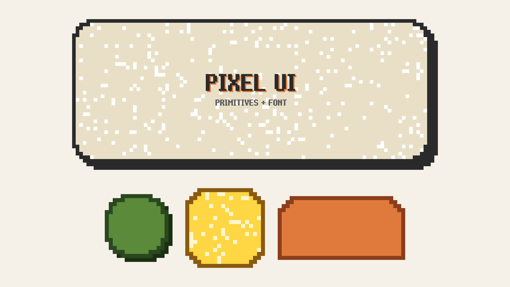
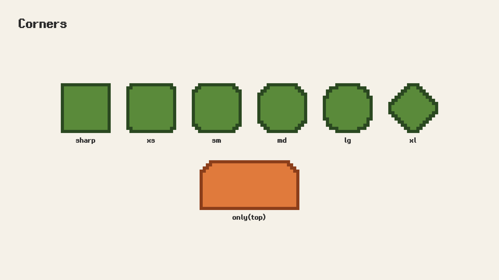
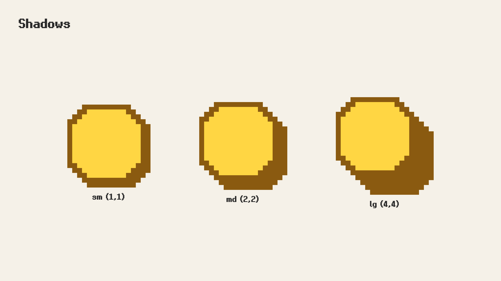
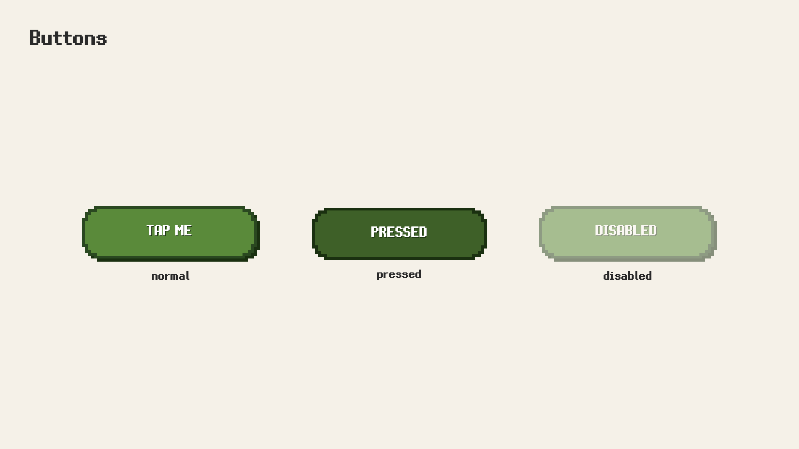
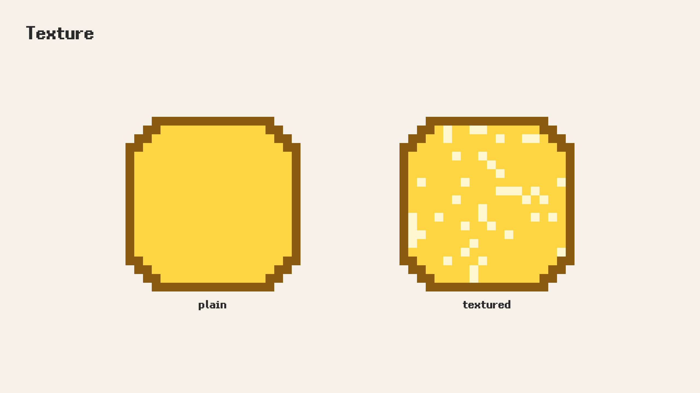
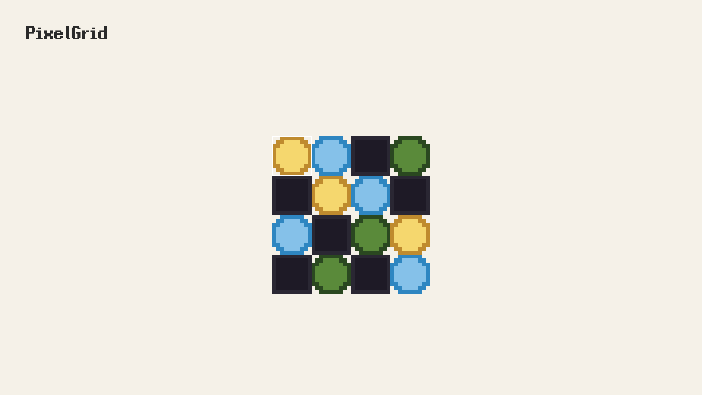
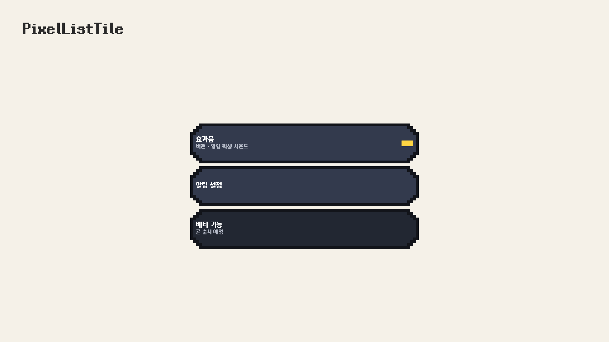
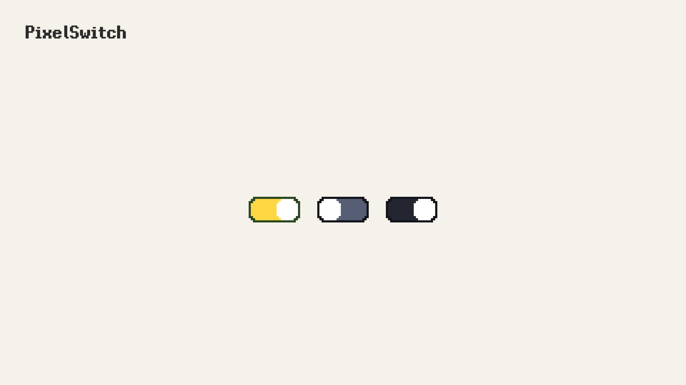

# pixel_ui

[](https://pub.dev/packages/pixel_ui)
[](LICENSE)
[](https://github.com/BottlePumpkin/pixel_ui/actions/workflows/test.yml)
[](https://github.com/BottlePumpkin/pixel_ui/actions/workflows/build.yml)
[](https://bottlepumpkin.github.io/pixel_ui/)

Pixel-art design system for Flutter — build retro, 8-bit, RPG-style game UIs with parametric shapes, tile grids, interactive buttons, pixel drop shadows, and a bundled pixel font.

**🎨 [Try the PixelShapeStyle tuner →](https://bottlepumpkin.github.io/pixel_ui/)**



## Features

- Stair-pattern asymmetric corners (`PixelCorners` with `.sharp`/`.xs`/`.sm`/`.md`/`.lg`/`.xl` presets, plus fully custom per-corner control)
- Deterministic LCG texture overlays
- Pixel-aware drop shadows with `.sm`/`.md`/`.lg` factories
- Press-state–aware interactive pixel buttons (`PixelButton`)
- Tile-grid layout widget (`PixelGrid<T>`) for minimaps, inventories, and tile maps — with keyboard focus and drag-and-drop
- Bundled Mulmaru pixel font (SIL OFL 1.1) with a ready-made `TextStyle` factory
- Zero external dependencies beyond the Flutter SDK

## Why pixel_ui?

Most Flutter pixel/retro packages ship a complete themed widget set tied to
a specific era (NES, Windows XP, Steam). `pixel_ui` is positioned
differently: it provides **low-level pixel primitives**
(`PixelShapePainter`, `PixelCorners`, `PixelShadow`, `PixelTexture`) plus a
small set of opinionated composite widgets (`PixelBox`, `PixelButton`,
`PixelGrid`, `PixelText`) and a **bundled pixel font**. Compose
inventories, minimaps, dialog frames, HP bars, and tile maps from
primitives that fit your art direction — instead of inheriting someone
else's chrome.

## Platforms

| Platform | Status | Verification |
|----------|--------|--------------|
| Android  | ✅      | CI build (debug APK) |
| iOS      | ✅      | CI build (no-codesign) |
| Web      | ✅      | CI build + smoke-tested on Chrome |
| macOS    | ✅      | CI build + smoke-tested locally |
| Linux    | ✅      | CI build |
| Windows  | ✅      | CI build |

> Web is smoke-tested on Chrome. Other browsers (Safari, Firefox)
> should work but are not part of release validation. Linux and Windows
> are validated by CI build only — please file an issue if you find
> rendering glitches on those platforms.

## Install

```yaml
dependencies:
  pixel_ui: ^0.5.0
```

## Quick Start

```dart
import 'package:flutter/widgets.dart';
import 'package:pixel_ui/pixel_ui.dart';

final style = PixelShapeStyle(
  corners: PixelCorners.lg,
  fillColor: const Color(0xFF5A8A3A),
  borderColor: const Color(0xFF2A4820),
  borderWidth: 1,
  shadow: PixelShadow.sm(const Color(0xFF1A3010)),
);

PixelButton(
  logicalWidth: 60,
  logicalHeight: 18,
  normalStyle: style,
  onPressed: () {},
  child: Text(
    'START',
    style: PixelText.mulmaru(fontSize: 18, color: const Color(0xFFFFFFFF)),
  ),
);
```

### Sizing model

`logicalWidth` and `logicalHeight` are **integer pixel-art grid cells**, not
screen pixels. When you don't pass `width:` / `height:`, the widget renders at
**logical size × 4** screen pixels (so `logicalWidth: 60, logicalHeight: 18`
→ 240×72 dp). Override either dimension to stretch the same logical grid to a
custom screen size — the painter still draws at the logical resolution so
pixels stay crisp. Aspect ratio is preserved if only one of `width`/`height`
is given.

The logical values also drive corner stair patterns, shadow offsets, and
texture cell sizes, so think of them as the "pixel art canvas" the design
is authored on.

## Theming

Wire `pixelUiTheme(...)` once on `MaterialApp.theme` and any descendant
`PixelBox` / `PixelButton` inherits its style — no need to repeat the same
`style:` / `normalStyle:` on every call site.

```dart
import 'package:flutter/material.dart';
import 'package:pixel_ui/pixel_ui.dart';

final panelStyle = PixelShapeStyle(
  corners: PixelCorners.md,
  fillColor: const Color(0xFF333A4D),
  borderColor: const Color(0xFF12141A),
  borderWidth: 1,
  shadow: PixelShadow.sm(const Color(0xFF000000)),
);

final buttonStyle = PixelShapeStyle(
  corners: PixelCorners.md,
  fillColor: const Color(0xFF5A8A3A),
  borderColor: const Color(0xFF2A4820),
  borderWidth: 1,
);

MaterialApp(
  theme: pixelUiTheme(
    base: ThemeData(brightness: Brightness.dark),
    pixelTheme: PixelTheme(
      box: PixelBoxTheme(style: panelStyle),
      button: PixelButtonTheme(normalStyle: buttonStyle),
    ),
  ),
  home: const SettingsScreen(),
);

// PixelBox / PixelButton may now omit their style props:
PixelBox(logicalWidth: 80, logicalHeight: 60, child: ...);
PixelButton(logicalWidth: 60, logicalHeight: 18, onPressed: () {}, child: ...);
```

`pixelUiTheme` accepts either a top-level `pixelTheme:` umbrella or
individual `boxTheme:` / `buttonTheme:` slots — explicit slots win when both
are provided.

### Style resolution precedence

For each widget, the first source that resolves a style is used:

1. Explicit `style:` / `normalStyle:` (or `pressedStyle:` / `disabledStyle:`) prop on the widget call site
2. The matching slot on `PixelBoxTheme` / `PixelButtonTheme` registered via `pixelUiTheme`
3. Asserts in debug if neither source produces a style — `PixelButton` further falls back to `normalStyle` rendered at 50% opacity for the disabled state

Read the resolved theme imperatively (e.g. inside a custom widget) with
`context.pixelTheme<T>()`:

```dart
final boxTheme = context.pixelTheme<PixelBoxTheme>();
final fill = boxTheme?.style?.fillColor ?? defaultFill;
```

## Usage

### PixelBox

A pixel-styled container. Pass any widget as `child`; size by logical pixels
(see [Sizing model](#sizing-model) above) or override with `width` / `height`.

```dart
PixelBox(
  style: PixelShapeStyle(
    corners: PixelCorners.md,
    fillColor: const Color(0xFF333A4D),
    borderColor: const Color(0xFF12141A),
    borderWidth: 1,
    shadow: PixelShadow.sm(const Color(0xFF000000)),
  ),
  logicalWidth: 80,
  logicalHeight: 60,
  padding: const EdgeInsets.all(8),
  alignment: Alignment.topLeft,
  child: Text('INVENTORY', style: PixelText.mulmaru(fontSize: 16)),
);
```

`style:` is optional when [Theming](#theming) is wired up — the box resolves
its style from `PixelBoxTheme.style` on the ancestor `Theme`.

#### Top-border label cutout

Pass a widget to `label:` and the painter carves a matching transparent
cutout in the top border, so the label appears to sit *through* the frame —
the classic `[ TITLE ]━━━━━` look. The cutout width is measured from the
label widget at layout time; `labelLeftInset` (in **logical pixels**, default
`2`) shifts it horizontally.

```dart
PixelBox(
  style: panelStyle,
  logicalWidth: 80,
  logicalHeight: 60,
  label: Padding(
    padding: const EdgeInsets.symmetric(horizontal: 4),
    child: Text(' INVENTORY ', style: PixelText.mulmaru(fontSize: 12)),
  ),
  labelLeftInset: 4,
  child: ...,
);
```

To plug in a custom `CustomPainter` (procedural fills, animated patterns, …)
without forking `PixelBox`, pass a `PixelShapePainterBuilder` to `painter:`
(precedence: `painter` prop > `PixelBoxTheme.painter` > built-in default).

### Corners

`PixelCorners` describes an asymmetric per-corner stair pattern. Use the provided scale constants or compose your own:

```dart
const PixelCorners.all([3, 2, 1])                     // symmetric medium
const PixelCorners.only(tl: [3, 2, 1], tr: [3, 2, 1]) // top tab

PixelCorners.sharp   // all square
PixelCorners.xs      // 1-pixel rounding
PixelCorners.md      // 3-row stair
PixelCorners.lg      // 4-row stair
```

### Shadows

```dart
PixelShadow.sm(Colors.black)                                 // offset (1, 1)
PixelShadow.md(Colors.black)                                 // offset (2, 2)
PixelShadow.lg(Colors.black)                                 // offset (4, 4)
const PixelShadow(offset: Offset(3, 2), color: Colors.black) // custom
```

### PixelButton

```dart
PixelButton(
  logicalWidth: 60,
  logicalHeight: 18,
  normalStyle: /* PixelShapeStyle */,
  pressedStyle: /* optional, falls back to normalStyle */,
  disabledStyle: /* optional, falls back to normalStyle at 50% opacity */,
  pressChildOffset: const Offset(0, 1),
  onPressed: () {},
  semanticsLabel: 'Start',
  child: /* your child widget */,
);
```

When `onPressed` is `null` the button is non-interactive. If you pass a
`disabledStyle` it renders at full opacity with that style; otherwise the
button falls back to `normalStyle` rendered at 50% opacity — a generic dim
that avoids a distracting visual when you don't need one.

### Texture

```dart
PixelShapeStyle(
  corners: PixelCorners.md,
  fillColor: const Color(0xFFFFD643),
  texture: const PixelTexture(
    color: Color(0xFFFFF7D0),
    density: 0.15,
    size: 1,
    seed: 7,
  ),
);
```

Textures use a deterministic LCG so identical settings produce identical patterns across platforms and builds.

### Direct CustomPaint integration

For custom compositions that `PixelBox` doesn't cover — minimaps, tile
grids, procedural layouts — use `PixelShapePainter` inside your own
`CustomPaint`. Size the canvas with the shadow-aware helper so drop
shadows never get clipped:

```dart
import 'package:pixel_ui/pixel_ui.dart';

final style = PixelShapeStyle(
  corners: PixelCorners.md,
  fillColor: const Color(0xFF5A8A3A),
  shadow: PixelShadow.md(const Color(0xFF1A3010)),
);

CustomPaint(
  size: PixelShapePainter.canvasSizeFor(
    style: style,
    logicalWidth: 16,
    logicalHeight: 16,
    scale: 4, // default — screen pixels per logical pixel
  ),
  painter: PixelShapePainter(
    logicalWidth: 16,
    logicalHeight: 16,
    style: style,
  ),
)
```

The helper returns `(logicalWidth × scale, logicalHeight × scale)` when
there's no shadow, and expands by `|shadow.offset|` on each axis
otherwise. If you compute canvas size yourself, mirror the formula:
`(logicalWidth + |shadow.offset.dx|) × scale` wide by
`(logicalHeight + |shadow.offset.dy|) × scale` tall.

### Tile grids

`PixelGrid<T>` lays out a 2D grid of `PixelShapePainter` tiles with
optional keyboard focus, tap callbacks, and `Draggable<T>`/`DragTarget<T>`
drag-and-drop. Use `.fromList` for static data or `.builder` for
procedural/large maps:

```dart
import 'package:pixel_ui/pixel_ui.dart';

enum Slot { sword, potion }

PixelGrid<Slot>.fromList(
  data: const [
    [Slot.sword, null],
    [null,       Slot.potion],
  ],
  tileLogicalWidth: 10,
  tileLogicalHeight: 10,
  tileScreenSize: const Size(48, 48),
  styleFor: (s) => s == Slot.sword ? swordStyle : potionStyle,
  emptyStyle: emptySlotStyle,
  dragDataFor: (x, y) => grid[y][x],  // null → non-draggable tile
  onTileAccept: (from, to, payload) { /* swap / merge / reject */ },
  onTileActivate: (x, y) { /* arrow keys + Enter/Space or a tap */ },
  autofocus: true,
)
```

Data indexing is `data[y][x]` (outer list = rows). Enter/Space activates
the focused tile only when its data is non-null — empty slots are not
"activatable".

### Typography

The package bundles the Mulmaru proportional pixel font. Use the factory helper:

```dart
Text('달려라', style: PixelText.mulmaru(fontSize: 20, color: Colors.white));
```

Or compose a custom `TextStyle` using the exposed constants:

```dart
Text(
  'hello',
  style: TextStyle(
    fontFamily: PixelText.mulmaruFontFamily,
    package: PixelText.mulmaruPackage,
    fontSize: 18,
  ),
);
```

#### Monospaced variant

For code, terminal-style UI, or fixed-width layouts, use `PixelText.mulmaruMono`:

```dart
Text(
  'HP 042/100',
  style: PixelText.mulmaruMono(fontSize: 12, color: Colors.white),
)
```

## Cookbook

Short, copy-pasteable recipes for common patterns. Each snippet stands alone
— assume `import 'package:pixel_ui/pixel_ui.dart';` at the top.

### HP / MP bar

Layer a filled `PixelBox` over a track `PixelBox` and clip with a `SizedBox`
proportional to the current value. Mono text reads "HP 042/100" without
jitter as the digits change.

```dart
Widget hpBar({required int current, required int max, double width = 120}) {
  final track = PixelShapeStyle(
    corners: PixelCorners.sm,
    fillColor: const Color(0xFF222732),
    borderColor: const Color(0xFF000000),
    borderWidth: 1,
  );
  final fill = PixelShapeStyle(
    corners: PixelCorners.sm,
    fillColor: const Color(0xFFD43A2F), // HP red
  );

  final ratio = (current / max).clamp(0.0, 1.0);
  return Row(children: [
    SizedBox(
      width: width,
      child: Stack(alignment: Alignment.centerLeft, children: [
        PixelBox(style: track, logicalWidth: 60, logicalHeight: 4, width: width, height: 8),
        SizedBox(
          width: width * ratio,
          child: PixelBox(style: fill, logicalWidth: 60, logicalHeight: 4, width: width * ratio, height: 8),
        ),
      ]),
    ),
    const SizedBox(width: 8),
    Text(
      'HP ${current.toString().padLeft(3, "0")}/$max',
      style: PixelText.mulmaruMono(fontSize: 12, color: const Color(0xFFFFFFFF)),
    ),
  ]);
}
```

### NPC dialog frame

Use asymmetric corners (`PixelCorners.only`) for a top "tab" and `label:` to
mount the speaker name through the border.

```dart
PixelBox(
  style: PixelShapeStyle(
    corners: const PixelCorners.only(tl: [3, 2, 1], tr: [3, 2, 1]),
    fillColor: const Color(0xFF1B1F2A),
    borderColor: const Color(0xFFFFD643),
    borderWidth: 1,
    shadow: PixelShadow.md(const Color(0xFF000000)),
  ),
  logicalWidth: 100,
  logicalHeight: 40,
  padding: const EdgeInsets.fromLTRB(12, 14, 12, 12),
  alignment: Alignment.topLeft,
  label: Padding(
    padding: const EdgeInsets.symmetric(horizontal: 4),
    child: Text(
      ' OLD MAN ',
      style: PixelText.mulmaru(fontSize: 12, color: const Color(0xFFFFD643)),
    ),
  ),
  labelLeftInset: 6,
  child: Text(
    '이 동굴 안엔\n무서운 게 산단다…',
    style: PixelText.mulmaru(fontSize: 14, color: const Color(0xFFFFFFFF)),
  ),
);
```

### Settings row

`PixelListTile` composes a leading / title+subtitle / trailing row into a
themed pixel container. Pass `onTap` for press feedback.

```dart
PixelListTile(
  style: PixelShapeStyle(
    corners: PixelCorners.md,
    fillColor: const Color(0xFF333A4D),
    borderColor: const Color(0xFF12141A),
    borderWidth: 1,
  ),
  pressedStyle: PixelShapeStyle(
    corners: PixelCorners.md,
    fillColor: const Color(0xFF464E66),
    borderColor: const Color(0xFF12141A),
    borderWidth: 1,
  ),
  title: Text('효과음', style: PixelText.mulmaru(fontSize: 14, color: const Color(0xFFFFFFFF))),
  subtitle: Text('버튼 · 알림 픽셀 사운드', style: PixelText.mulmaru(fontSize: 11, color: const Color(0xFFB7BCC9))),
  trailing: Text('ON', style: PixelText.mulmaruMono(fontSize: 12, color: const Color(0xFFFFD643))),
  onTap: () {},
);
```

Wire `pixelUiTheme(listTileTheme: PixelListTileTheme(...))` to apply the
container style across all tiles app-wide. See [Theming](#theming).

### Pixel switch

Drop-in pixel-styled toggle for settings, preferences, and on/off rows.
Tap or `Space` / `Enter` (when focused) toggles the value; the thumb
slides over `animationDuration` (default 120 ms).

```dart
PixelSwitch(
  value: soundOn,
  onChanged: (v) => setState(() => soundOn = v),
  onTrackStyle: PixelShapeStyle(
    corners: PixelCorners.sm,
    fillColor: const Color(0xFFFFD643),
    borderColor: const Color(0xFF2A4820),
    borderWidth: 1,
  ),
  offTrackStyle: PixelShapeStyle(
    corners: PixelCorners.sm,
    fillColor: const Color(0xFF555E73),
    borderColor: const Color(0xFF12141A),
    borderWidth: 1,
  ),
  thumbStyle: PixelShapeStyle(
    corners: PixelCorners.sm,
    fillColor: const Color(0xFFFFFFFF),
  ),
  semanticsLabel: '효과음',
);
```

Wire `pixelUiTheme(switchTheme: PixelSwitchTheme(...))` to share style
across all switches app-wide. See [Theming](#theming).

### Tappable inventory slot

Wrap a `PixelBox` background in a `PixelButton` for pressable feedback. For
a full grid with keyboard focus and drag-and-drop, see
[Tile grids](#tile-grids).

```dart
PixelButton(
  logicalWidth: 16,
  logicalHeight: 16,
  normalStyle: PixelShapeStyle(
    corners: PixelCorners.sm,
    fillColor: const Color(0xFF333A4D),
    borderColor: const Color(0xFF12141A),
    borderWidth: 1,
  ),
  pressedStyle: PixelShapeStyle(
    corners: PixelCorners.sm,
    fillColor: const Color(0xFF5A8A3A),
    borderColor: const Color(0xFF2A4820),
    borderWidth: 1,
  ),
  pressChildOffset: const Offset(0, 1),
  onPressed: () => useItem(),
  semanticsLabel: 'Potion',
  child: Text('🧪', style: PixelText.mulmaruMono(fontSize: 18)),
);
```

## Gallery

| Corners | Shadows |
| --- | --- |
|  |  |

| Buttons | Texture |
| --- | --- |
|  |  |

| Tile grids | List tiles |
| --- | --- |
|  |  |

| Switches | |
| --- | --- |
|  | |

## Example

See `example/lib/main.dart` for a full showcase of every primitive. Run:

```bash
cd example
flutter run
```

## Bundled Font

This package bundles the [Mulmaru](https://github.com/mushsooni/mulmaru) pixel fonts (proportional + monospaced variants) by **mushsooni**, distributed under the SIL Open Font License 1.1.

See [OFL.txt](OFL.txt) for the full font license. Apps using `pixel_ui` should include OFL attribution in their open-source license disclosures; Flutter's `showLicensePage()` handles this automatically when the bundling note (see [LICENSE](LICENSE)) is in place.

## Contributing

Issues and PRs are welcome at [github.com/BottlePumpkin/pixel_ui/issues](https://github.com/BottlePumpkin/pixel_ui/issues).

Internal quality improvement cycles use the `dogfood` label. To view only user-facing issues:
[open issues excluding dogfood](https://github.com/BottlePumpkin/pixel_ui/issues?q=is%3Aopen+-label%3Adogfood).

## License

MIT for code (see [LICENSE](LICENSE)). Bundled Mulmaru font is under SIL OFL 1.1 (see [OFL.txt](OFL.txt)).
